  

  <a href="mailto:bitupanborah1k@gmail.com" style="display:inline-block; padding:8px 20px; margin:4px; border:1px solid rgba(243,242,239,0.18); border-radius:100px; color:#f3f2ef; text-decoration:none; background:rgba(243,242,239,0.03);">email</a>
  <a href="https://github.com/bitzzdev" style="display:inline-block; padding:8px 20px; margin:4px; border:1px solid rgba(243,242,239,0.18); border-radius:100px; color:#f3f2ef; text-decoration:none; background:rgba(243,242,239,0.03);">github ↗</a>
  <a href="https://instagram.com/bitz.dev" style="display:inline-block; padding:8px 20px; margin:4px; border:1px solid rgba(243,242,239,0.18); border-radius:100px; color:#f3f2ef; text-decoration:none; background:rgba(243,242,239,0.03);">instagram</a>

  

  

    About
  

  <h2 style="font-family:Georgia, 'Times New Roman', serif; font-weight:400; font-size:32px; color:#f3f2ef; margin:10px 0 16px;">The story behind the craft</h2>
  

    Hey, I'm <strong style="color:#f3f2ef;">Bitupan</strong>. I started bitz.dev because I watched businesses struggle with sluggish, over-engineered websites that never converted despite the quality of their products. That gap became an obsession — I've spent years breaking down what separates forgettable digital presence from work that actually moves people. When we work together, I'm immersed in your story, ruthless about what moves people, and built to close the gap between who you are and how the world sees you.
  

  

    Work
  

  <h2 style="font-family:Georgia, 'Times New Roman', serif; font-weight:400; font-size:32px; color:#f3f2ef; margin:10px 0 4px;">Selected projects</h2>
  
All public repositories · each card links to its source

<table style="border-collapse:separate; border-spacing:14px 14px; max-width:860px; margin:0 auto;">
  <tr>
    <td style="width:50%; padding:0;">
      

        

        
01

        <a href="https://github.com/bitzzdev/bitzdots" style="font-family:Georgia, serif; font-size:21px; color:#f3f2ef; text-decoration:none;">bitzdots ↗</a>
        
Lean Hyprland dotfiles with automatic wallust theming. Low-end optimized, full-stack auto-coloring, 26 Jinja2 templates.

        

          Shell
          ·★ 2
          ·⑂ 1
        

      

    </td>
    <td style="width:50%; padding:0;">
      

        

        
02

        <a href="https://github.com/bitzzdev/bitzzdev" style="font-family:Georgia, serif; font-size:21px; color:#f3f2ef; text-decoration:none;">bitzzdev ↗</a>
        
This profile. The home of the pixel-perfect web experiences I ship every day.

        

          HTML
        

      

    </td>
  </tr>
  <tr>
    <td style="width:50%; padding:0;">
      

        

        
03

        <a href="https://github.com/bitzzdev/Nodus" style="font-family:Georgia, serif; font-size:21px; color:#f3f2ef; text-decoration:none;">Nodus ↗</a>
        
A visual thinking workspace for building and organizing software projects.

        

          Kotlin
        

      

    </td>
    <td style="width:50%; padding:0;">
      

        

        
04

        <a href="https://github.com/bitzzdev/NexUI" style="font-family:Georgia, serif; font-size:21px; color:#f3f2ef; text-decoration:none;">NexUI ↗</a>
        
Fully customize Minecraft's interface with drag-and-drop HUD editing and a modern design studio.

        

          Java
        

      

    </td>
  </tr>
  <tr>
    <td style="width:50%; padding:0;">
      

        

        
05

        <a href="https://github.com/bitzzdev/skills" style="font-family:Georgia, serif; font-size:21px; color:#f3f2ef; text-decoration:none;">skills ↗</a>
        
AI agent skill definitions for opencode — Minecraft modding, shaderpack dev, Three.js sites, Android apps.

        

          Shell
        

      

    </td>
    <td style="width:50%; padding:0;">
      

        

        
06

        <a href="https://github.com/bitzzdev/fixes" style="font-family:Georgia, serif; font-size:21px; color:#f3f2ef; text-decoration:none;">fixes ↗</a>
        
Workarounds for Termux and Arch Linux, collected and battle-tested.

        

          Shell
        

      

    </td>
  </tr>
  <tr>
    <td style="width:50%; padding:0;">
      

        

        
07

        <a href="https://github.com/bitzzdev/hyprconfig" style="font-family:Georgia, serif; font-size:21px; color:#f3f2ef; text-decoration:none;">hyprconfig ↗</a>
        
E-ink themed Hyprland dotfiles with Quickshell top bar and dynamic matugen color generation.

        

          QML
        

      

    </td>
    <td style="width:50%; padding:0;">
      

        

        
08

        <a href="https://github.com/bitzzdev/stasis" style="font-family:Georgia, serif; font-size:21px; color:#f3f2ef; text-decoration:none;">stasis ↗</a>
        
Fabric server-side Minecraft mod that reduces BlockEntity tick load with activity-aware scheduling.

        

          Java
        

      

    </td>
  </tr>
  <tr>
    <td style="width:50%; padding:0;">
      

        

        
09

        <a href="https://github.com/bitzzdev/tiv" style="font-family:Georgia, serif; font-size:21px; color:#f3f2ef; text-decoration:none;">tiv ↗</a>
        
Minimal GTK-based GUI image viewer for Linux with keyboard navigation.

        

          C
        

      

    </td>
    <td style="width:50%; padding:0;">
      

        

        
10

        <a href="https://github.com/bitzzdev/CustomPaintings" style="font-family:Georgia, serif; font-size:21px; color:#f3f2ef; text-decoration:none;">CustomPaintings ↗</a>
        
Minecraft Paper plugin for uploading PNGs and creating map-based paintings, including multi-map murals.

        

          Java
        

      

    </td>
  </tr>
  <tr>
    <td style="width:50%; padding:0;">
      

        

        
11

        <a href="https://github.com/bitzzdev/MineGPT" style="font-family:Georgia, serif; font-size:21px; color:#f3f2ef; text-decoration:none;">MineGPT ↗</a>
        
In-game AI chat assistant for Minecraft with multi-provider LLM support (OpenAI, Anthropic, Gemini, OpenRouter).

        

          Java
        

      

    </td>
    <td style="width:50%; padding:0;">
      

        

        
12

        <a href="https://github.com/bitzzdev/bye-bye-falling-leaves" style="font-family:Georgia, serif; font-size:21px; color:#f3f2ef; text-decoration:none;">bye-bye-falling-leaves ↗</a>
        
Minecraft resource pack that removes all falling leaf and cherry blossom particles for cleaner visuals.

        

          Resource Pack
        

      

    </td>
  </tr>
  <tr>
    <td style="width:50%; padding:0;">
      

        

        
13

        <a href="https://github.com/bitzzdev/cartoonee" style="font-family:Georgia, serif; font-size:21px; color:#f3f2ef; text-decoration:none;">cartoonee ↗</a>
        
Minecraft texture pack that redesigns swords in a bold cartoon style while keeping the rest vanilla.

        

          Resource Pack
        

      

    </td>
    <td style="width:50%; padding:0;">
      

        

        
14

        <a href="https://github.com/bitzzdev/Pulse" style="font-family:Georgia, serif; font-size:21px; color:#f3f2ef; text-decoration:none;">Pulse ↗</a>
        
Adaptive Performance Manager for Minecraft that monitors rendering performance and adjusts visual quality dynamically.

        

          Java
        

      

    </td>
  </tr>
  <tr>
    <td style="width:50%; padding:0;">
      

        

        
15

        <a href="https://github.com/bitzzdev/JustVanilla" style="font-family:Georgia, serif; font-size:21px; color:#f3f2ef; text-decoration:none;">JustVanilla ↗</a>
        
Vanilla-enhancing Minecraft shaderpack with real-time shadows, optimized for all hardware.

        

          GLSL
        

      

    </td>
    <td style="width:50%; padding:0;">
      

        

        
16

        <a href="https://github.com/bitzzdev/oha" style="font-family:Georgia, serif; font-size:21px; color:#f3f2ef; text-decoration:none;">oha ↗</a>
        
Terminal-based fullscreen text editor written in C with file manager and syntax highlighting.

        

          C
        

      

    </td>
  </tr>
  <tr>
    <td style="width:50%; padding:0;">
      

        

        
17

        <a href="https://github.com/bitzzdev/RealisticallyOptimized" style="font-family:Georgia, serif; font-size:21px; color:#f3f2ef; text-decoration:none;">RealisticallyOptimized ↗</a>
        
Stylized toon-lighting Minecraft shaderpack with real-time shadows, optimized for performance.

        

          GLSL
        

      

    </td>
    <td style="width:50%; padding:0;"></td>
  </tr>
</table>

  

    Process
  

  <h2 style="font-family:Georgia, 'Times New Roman', serif; font-weight:400; font-size:32px; color:#f3f2ef; margin:10px 0 18px;">How we build together</h2>

  

    

      01Discovery
    

    
We dive deep into your brand, audience, and goals to understand what makes you unique and how to position you for success.

  

  

    

      02Strategy
    

    
We craft a clear roadmap that aligns your digital presence with your business objectives, ensuring every decision serves your growth.

  

  

    

      03Execution
    

    
We build with precision, combining clean code with thoughtful design to create experiences that convert and impress.

  

  

    Services
  

  <h2 style="font-family:Georgia, 'Times New Roman', serif; font-weight:400; font-size:32px; color:#f3f2ef; margin:10px 0 18px;">What I offer</h2>

  

    01
    

      
Custom Web Applications

      
Robust, interactive Single Page Applications tailored with modern JavaScript ecosystems.

    

  

  

    02
    

      
UI/UX Responsive Design

      
Mobile-first design schemas with fluid animations and cohesive color systems.

    

  

  

    03
    

      
Performance & SEO Auditing

      
Eliminating script bloat and optimizing media for high Core Web Vital compliance.

    

  

  

    ● ● ●
    ~/bitz.dev — zsh
  

  <pre style="margin:0; padding:18px 22px; font-family:'JetBrains Mono', 'SFMono-Regular', Consolas, monospace; font-size:12.5px; line-height:1.9; color:rgba(243,242,239,0.8); overflow:auto;">
$ ~/bitz.dev whoami
bitupan
$ ~/bitz.dev stack --list
next.js · react · typescript · node
$ ~/bitz.dev ship --prod
✓ deployed in 0.8s</pre>

  

  © 2026 bitz.dev · Handcrafted locally in India · All rights reserved

